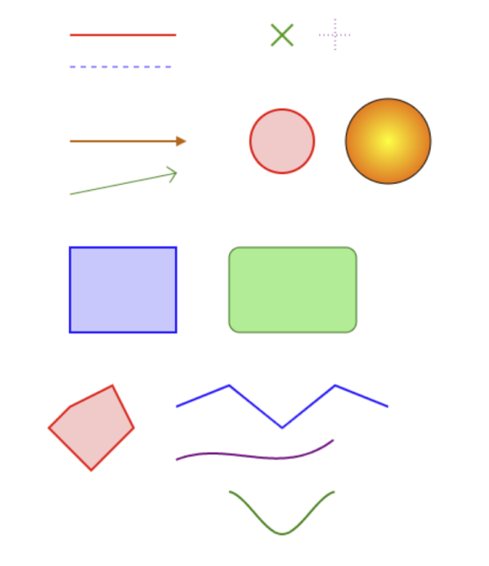

# Canvas Helpers

This is a collection of helper functions for drawing on an HTML5 Canvas.

It's an unopinionated library that aims to reduce the amount of repetitive boilerplate in your rendering code. It doesn't wrap the entire Canvas API, and mostly everything is optional, so you can always fall back to native Canvas code when necessary.



## Installation

```bash
npm install @basementuniverse/canvas-helpers
```

## Functions

### `withContext`

```ts
/**
 * Pass in a context and some number of functions that take a context as their
 * first argument, and return an array of functions that don't require the
 * context argument
 *
 * If only one function is passed, this will return a single function
 */
function withContext(
  context: CanvasRenderingContext2D,
  ...functions: ((context: CanvasRenderingContext2D, ...args: any[]) => void)[]
): ((...args: any[]) => void) | ((...args: any[]) => void)[];
```

Example:

```ts
import {
  withContext,
  line,
  rect,
  circle,
} from '@basementuniverse/canvas-helpers';

const canvas = document.createElement('canvas');
const context = canvas.getContext('2d');

const [
  lineWithContext,
  rectWithContext,
] = withContext(context, [line, rect]);

const circleWithContext = withContext(context, circle);

// These functions can now be called without the context argument...
lineWithContext([10, 10], [100, 100]);
```

### `line`

```ts
/**
 * Draw a straight line segment between two points
 */
function line(
  context: CanvasRenderingContext2D,
  start: vec2,
  end: vec2,
  style?: StyleOptions
): void;
```

### `cross`

```ts
/**
 * Draw a cross at a given position with a specified size
 */
function cross(
  context: CanvasRenderingContext2D,
  position: vec2,
  size: number,
  style?: StyleOptions
): void;
```

### `arrow`

```ts
/**
 * Draw an arrow from a start point to an end point with an optional arrowhead
 * at the end
 *
 * This function does not support batch drawing since it requires
 * beginning a new path for the arrowhead
 */
function arrow(
  context: CanvasRenderingContext2D,
  start: vec2,
  end: vec2,
  style?: StyleOptions
): void;
```

### `circle`

```ts
/**
 * Draw a circle at a specified center point with a given radius
 */
function circle(
  context: CanvasRenderingContext2D,
  center: vec2,
  radius: number,
  style?: StyleOptions
): void;
```

### `rectangle`

```ts
/**
 * Draw a rectangle at a specified position with a given size
 */
function rectangle(
  context: CanvasRenderingContext2D,
  position: vec2,
  size: vec2,
  style?: StyleOptions
): void;
```

### `polygon`

```ts
/**
 * Draw a polygon defined by an array of vertices
 */
function polygon(
  context: CanvasRenderingContext2D,
  vertices: vec2[],
  style?: StyleOptions
): void;
```

### `path`

```ts
/**
 * Draw a path defined by an array of vertices
 */
function path(
  context: CanvasRenderingContext2D,
  vertices: vec2[],
  style?: StyleOptions
): void;
```

## Types

```ts
type Color = {
  r: number;
  g: number;
  b: number;
  a?: number;
};

type StyleOptions = {
  /**
   * If set to true, don't begin a new path before drawing
   *
   * This allows for batch-drawing multiple shapes with a single path
   */
  batch?: boolean;

  /**
   * Whether to fill shapes with color
   */
  fill: boolean;

  /**
   * The color to use for filling shapes
   *
   * If null, don't set the fillStyle (we assume it has been set elsewhere)
   */
  fillColor: Color | string | null;

  /**
   * The gradient to use for filling shapes, if any
   */
  gradient: {
    /**
     * The type of gradient to create
     * - 'linear' for a linear gradient
     * - 'radial' for a radial gradient
     */
    type: 'linear' | 'radial';

    /**
     * The starting point of the gradient, as a vector { x, y }
     * For radial gradients, this is the center point
     */
    start: vec2;

    /**
     * The ending point of the gradient, as a vector { x, y }
     */
    end: vec2;

    /**
     * An array of color stops defining the gradient
     */
    colorStops: {
      /**
       * The color at this stop
       */
      color: Color | string;

      /**
       * The position of the color stop, from 0 to 1
       */
      position: number;
    }[];
  } | null;

  /**
   * Whether to stroke shapes with lines
   */
  stroke: boolean;

  /**
   * The color to use for drawing lines
   *
   * If null, don't set the strokeStyle (we assume it has been set elsewhere)
   */
  strokeColor: Color | string | null;

  /**
   * The width of the lines
   *
   * If null, don't set the lineWidth (we assume it has been set elsewhere)
   */
  lineWidth: number | null;

  /**
   * The style of the line (e.g., solid, dashed)
   */
  lineStyle: 'solid' | 'dashed' | 'dotted';

  /**
   * The dash pattern for dashed lines, if applicable
   * An array of numbers specifying the lengths of dashes and gaps
   *
   * If null, don't set the lineDash (we assume it has been set elsewhere)
   */
  lineDash: number[] | null;

  /**
   * The type of cross to draw
   */
  crossStyle?: '+' | 'x';

  /**
   * If true, round the corners of rectangles and triangles
   */
  rounded?: boolean;

  /**
   * The radius to use for rounding corners in rectangles
   *
   * This is only used if `rounded` is true
   */
  borderRadius?: number;

  /**
   * Options for drawing arrowheads at the end of arrows
   */
  arrow?: {
    /**
     * The type of arrowhead to draw at the end of the line
     *
     * This can be a predefined type, or a function for drawing custom arrowheads
     */
    type:
      | 'caret' // Triangle pointing in the direction of the line
      | 'chevron' // V-shaped arrowhead
      | ((context: CanvasRenderingContext2D, ...args: any[]) => void);

    /**
     * The size of the arrowhead in pixels
     */
    size: number;
  } | null;

  /**
   * When stroking a path, the type of interpolation to use for curves
   */
  pathType?: 'linear' | 'bezier' | 'catmull-rom';

  /**
   * If using bezier curves, the order of the bezier path
   *
   * This determines how many control points are used for the bezier curve
   *
   * For example:
   * - 1: Linear (no control points, same as 'linear' pathType)
   * - 2: Quadratic bezier (1 control point)
   * - 3: Cubic bezier (2 control points)
   * - etc.
   */
  bezierOrder?: number;

  /**
   * If using catmull-rom curves, the tension parameter for the curve
   * - 0.0: Uniform spline (smoothest)
   * - 0.5: Centripetal spline (good for avoiding loops)
   * - 1.0: Chordal spline (more angular)
   */
  catmullRomTension?: number;
};
```
